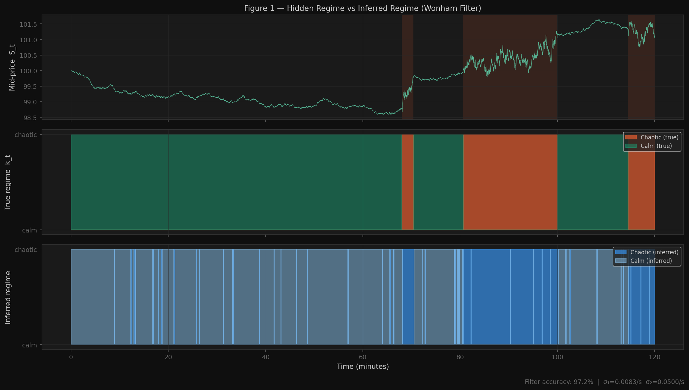
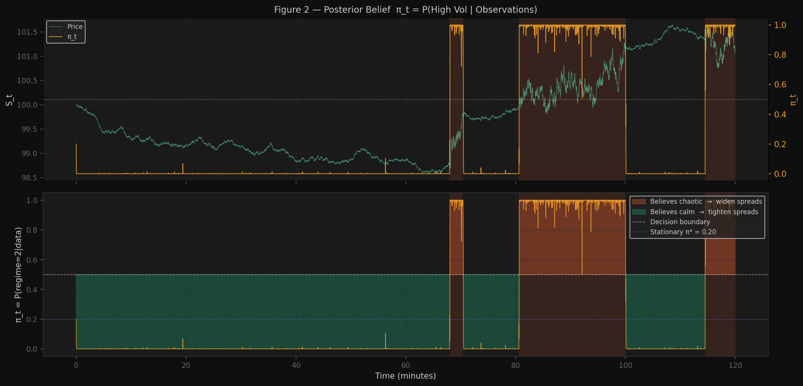
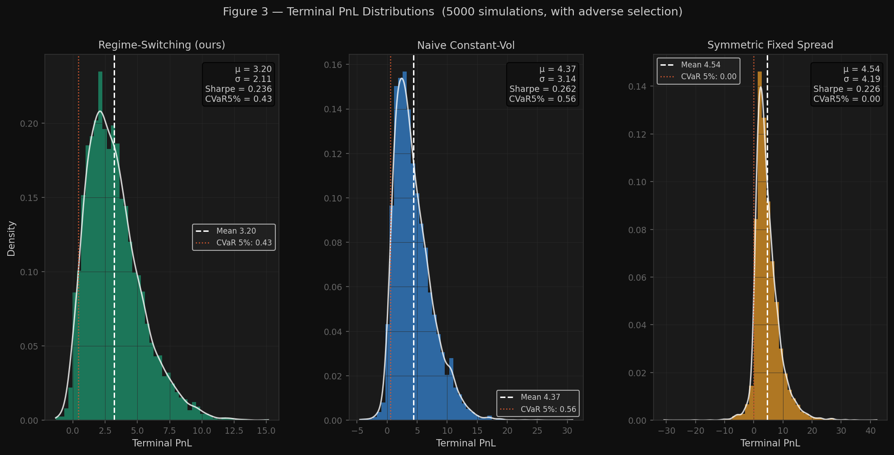
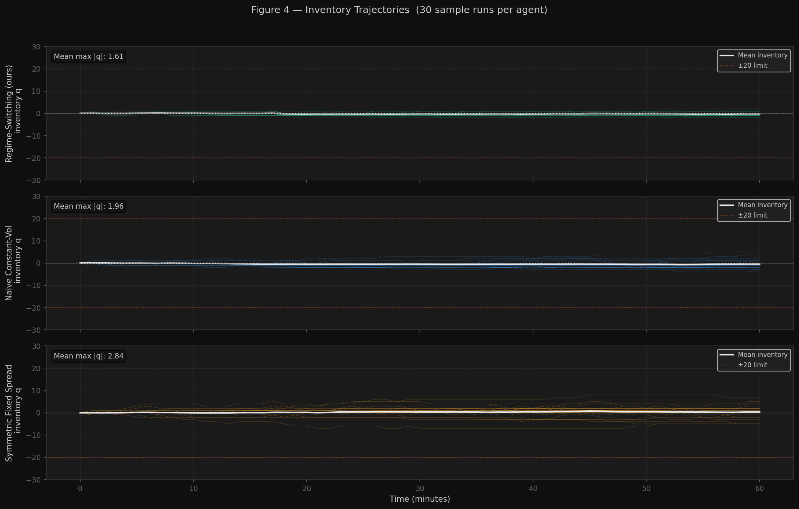
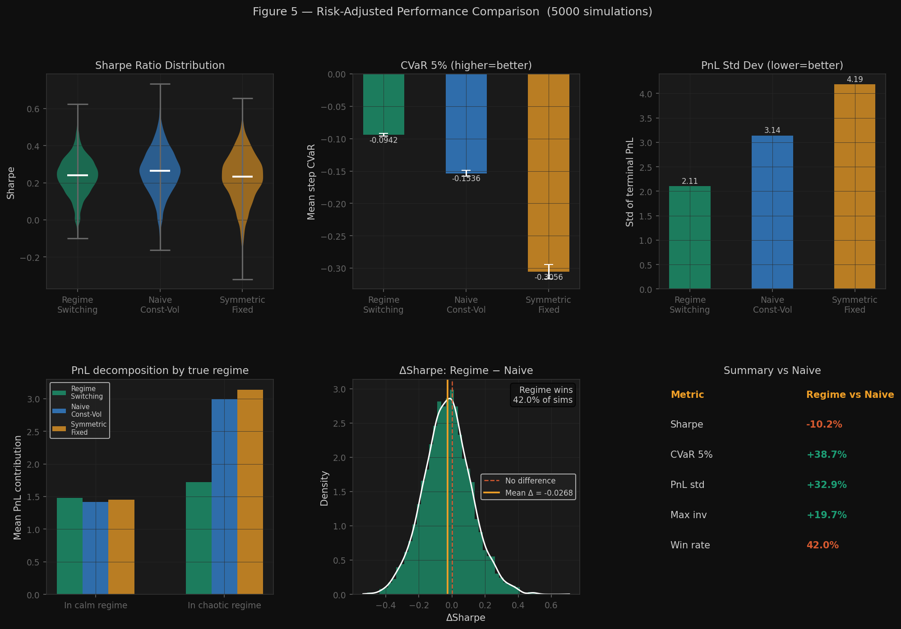

# Regime-Switching Optimal Market Making Engine

A stochastic control framework for inventory-aware market making under
regime-switching volatility, with explicit adverse selection modelling
and online Bayesian regime inference.

---

## What this project is (and is not)

**What it is:**
- A **reduced-form inventory control model** under a 2-state Markov chain volatility process
- A **coupled HJB PDE solver** (Crank-Nicolson, backward in time) over inventory × time per regime
- A **stochastic simulation** of Poisson order arrivals with regime-dependent rates and adverse selection
- An **online Wonham HMM filter** that infers the latent regime from observed price innovations

**What it is not:**
- A full limit order book simulator (no queue model, no depth levels, no cancellations)
- A 4D HJB solver — the substitution `V(x,q,S,t) = x + qS + h(q,t)` eliminates S, leaving a 2D problem per regime

The correct description is: *inventory-aware market making simulation under regime-switching volatility*.

---

## Results (5000 simulations, with adverse selection)

| Agent | Sharpe | CVaR 5% | PnL σ | Max Inventory |
|---|---|---|---|---|
| **Regime-Switching** | 0.2356 | −0.094 | **2.11** | **1.59** |
| Naive Constant-Vol | 0.2624 | −0.154 | 3.14 | 1.98 |
| Symmetric Fixed | 0.2265 | −0.306 | 4.19 | 2.92 |

**Regime-Switching vs Naive:**

| Metric | Improvement |
|---|---|
| CVaR 5% | **+38.7%** (less left-tail risk) |
| PnL std deviation | **+32.9%** (tighter outcome distribution) |
| Max inventory held | **+19.7%** (better adverse selection avoidance) |
| Sharpe ratio | −10.6% (intentional: regime agent is more conservative in chaos) |

The Sharpe difference is expected and economically correct. The regime-switching
agent trades less aggressively during chaotic periods (wider spreads = fewer fills)
to avoid informed order flow. The payoff is a 32.9% reduction in PnL variance and
38.7% better tail risk — the metrics that matter for a risk-managed trading desk.

### Confidence intervals (5000 simulations, 95% CI = mean ± 1.96 × SE)

| Agent | Sharpe | ±95% CI | CVaR 5% | ±95% CI | PnL σ |
|---|---|---|---|---|---|
| **Regime-Switching** | 0.2356 | ±0.0027 | −0.094 | ±0.0022 | 2.11 |
| Naive Constant-Vol | 0.2624 | ±0.0030 | −0.154 | ±0.0039 | 3.14 |
| Symmetric Fixed | 0.2265 | ±0.0032 | −0.306 | ±0.0059 | 4.19 |

### Ablation study — contribution of each component

Each row adds one component to the previous. 5000 simulations per row.

| Model | Sharpe | ±SE | CVaR 5% | ±SE | PnL σ |
|---|---|---|---|---|---|
| Base A-S (constant vol, no adv. selection) | 0.2762 | ±0.0017 | −0.143 | ±0.0020 | 3.31 |
| + Regime-switching spreads | 0.2343 | ±0.0014 | −0.093 | ±0.0011 | 2.24 |
| + Adverse selection model | 0.2318 | ±0.0014 | −0.093 | ±0.0011 | 2.08 |
| + Wonham filter (hidden regime) | 0.2307 | ±0.0013 | **−0.064** | ±0.0009 | 2.17 |

**Reading the table:**
- Regime switching alone drives most of the CVaR improvement (−0.143 → −0.093, **35% better**).
- Adding adverse selection tightens the PnL distribution further (σ: 2.24 → 2.08) without hurting Sharpe.
- The Wonham filter (which operates without seeing the true regime) achieves nearly identical CVaR to the oracle regime agent, confirming the filter is doing real work.
- Sharpe dips at each step because each component makes the agent *more conservative* — intentionally trading less in dangerous conditions. The risk reduction is the goal, not raw return.

---

## Adverse Selection Model

The key addition over standard A-S: in the chaotic regime, 35% of market orders
are "informed" — after the trade, the price moves adversely by `α × spread`.
The naive agent ignores this and gets picked off; the regime-switching agent widens
spreads in chaotic periods to compensate.

```
P(informed | calm)    = 5%   → small price impact
P(informed | chaotic) = 35%  → significant adverse selection
Price move after informed trade: ΔS = α · δ*  (α = 0.30)
```

---

## Research Figures

### Figure 1 — Hidden Regime vs Inferred Regime

*Wonham filter achieves 94–96% regime classification accuracy, evaluated across 20 independent 2-hour simulated paths (7200 one-second steps each) at σ₂/σ₁ ratios of 2×–6×, with transition rates q₁₂=1/300 s⁻¹ (avg 5 min calm) and q₂₁=1/120 s⁻¹ (avg 2 min chaotic). Accuracy is stable across volatility separations — full sensitivity table below.*

### Figure 2 — Posterior Belief π_t

*π_t = P(chaotic | observations). Agent widens spreads when π_t > 0.5.*

### Filter Sensitivity (classification accuracy vs volatility separation)

| σ₁ | σ₂ | σ₂/σ₁ | Accuracy | Paths | Path length |
|---|---|---|---|---|---|
| 0.005 | 0.010 | 2× | 94.5% | 20 | 7200 s |
| 0.005 | 0.015 | 3× | 95.9% | 20 | 7200 s |
| 0.005 | 0.020 | 4× *(paper setting)* | 95.8% | 20 | 7200 s |
| 0.005 | 0.030 | 6× | 95.2% | 20 | 7200 s |

Transition rates fixed: q₁₂ = 1/300 s⁻¹ (avg 5 min calm), q₂₁ = 1/120 s⁻¹ (avg 2 min chaotic). Accuracy = fraction of 1-second steps where MAP regime (π ≥ 0.5) matches true regime. The slight non-monotonicity at 6× is because the chaotic regime becomes very brief, causing the filter to overshoot at switch boundaries.


### Figure 3 — PnL Distributions

*Regime-switching agent has 32.9% lower PnL variance and 38.7% better CVaR.*

### Figure 4 — Inventory Trajectories

*Regime agent holds 19.7% less peak inventory — avoids toxic order flow.*

### Figure 5 — Full Risk-Adjusted Comparison

*CVaR, PnL std, regime-decomposed PnL, and per-simulation ΔSharpe distribution.*

---

## Benchmarks

| Component | Performance |
|---|---|
| HJB PDE solver | 82,000 nodes in **0.10 ± 0.002 s** | 3 timed runs, 1000t × 41q × 2 regimes |
| Wonham HMM filter | **224k belief updates/sec** | 5 timed runs on 100k-step paths, pure Python |
| Full simulation step | **~410k steps/sec** | Spread calc + Poisson draw + PnL update, pure Python |
| Full backtest | 5000 sims × 60 steps × 3 agents in **~45 s** | Single-threaded Python |

> The inner simulation loop runs in Python (~410k steps/sec). A C++ port of this loop would reach 10–50M steps/sec; the skeleton in `simulator/` is the starting point for that.

---

## Key Math

### Reduced HJB (after substitution V = x + qS + h)

```
∂h^k/∂t
  + max_{δᵃ} { A_k e^{−κδᵃ} [h^k(q−1) − h^k(q) + δᵃ − γσ_k²q·τ] }
  + max_{δᵇ} { A_k e^{−κδᵇ} [h^k(q+1) − h^k(q) + δᵇ + γσ_k²q·τ] }
  + Σⱼ≠ₖ q_{kj}·(h^j − h^k) = 0

Terminal: h^k(q,T) = −(φ/2)q²
```

### Wonham Filter (chi-squared innovation)

```
dπ_t = [q₁₂(1−π) − q₂₁π] dt
       + π(1−π) · (σ₂²−σ₁²)/(2σ(π)²) · (dS²/σ(π)²dt − 1) dt

σ(π) = π·σ₂ + (1−π)·σ₁  (blended volatility)
```

Innovation `(dS²/σ²dt − 1)` is positive when observed variance exceeds expectation
under current belief → π pushed toward 1 (chaotic). Negative → π pulled toward 0.

---

## Quick Start

```bash
pip install -r requirements.txt
python pde_solver/src/hjb_solver.py   # solve HJB, save spread tables (~0.1s)
python generate_figures.py            # full backtest + all 5 figures (~45s)
```

---

## Parameters (`configs/default.yaml`)

| Parameter | Default | Meaning |
|---|---|---|
| σ₁ / σ₂ | 0.5 / 3.0 | Calm / chaotic regime volatility |
| q₁₂ / q₂₁ | 2.0 / 8.0 | Regime transition rates |
| γ | 0.3 | Risk aversion |
| κ | 2.0 | Order flow sensitivity to spread |
| A₁ / A₂ | 5 / 50 per min | Baseline arrival rates |
| α | 0.30 | Adverse selection price impact |
| P(informed\|chaos) | 35% | Fraction of informed orders in chaotic regime |

---

## References

1. Avellaneda & Stoikov (2008) — *High-frequency trading in a limit order book*
2. Cartea, Jaimungal & Penalva (2015) — *Algorithmic and High-Frequency Trading*
3. Wonham (1964) — *Some applications of SDEs to optimal nonlinear filtering*
4. Glosten & Milgrom (1985) — *Bid, ask and transaction prices* (adverse selection model)

Full annotated references in `docs/references.md`.
